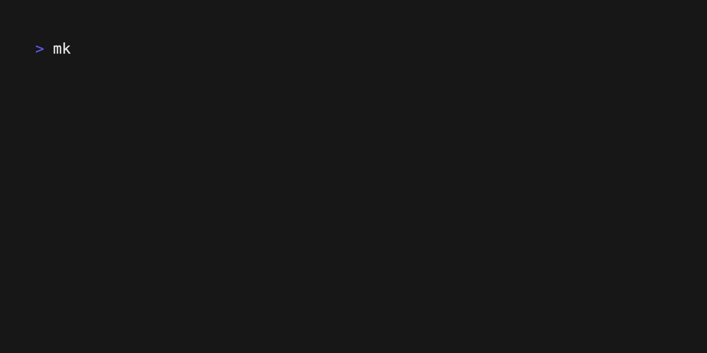
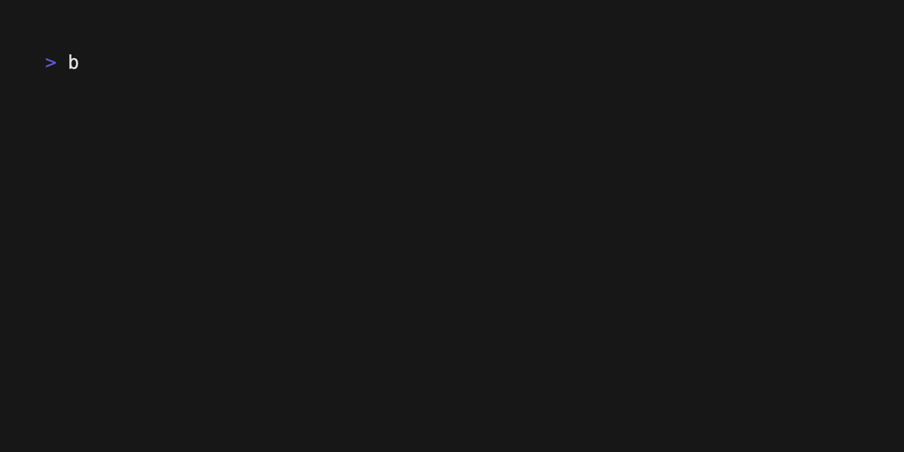

# Computer Programming : Kindergarten

This project is for education only.

### Prerequisite
- Install Bun (JavaScript runtime) by following the instructions [**here**](https://bun.sh/docs/installation).
- Use any text editor you prefer (VS Code, Emacs, Vim, etc.).

## Create new project

To create a new project. Open your terminal and start with these command.

```bash
mkdir <name> // replace <name> with your project name
cd <name>
bun init .
<Press enter 2 times>
```



## Add Biome for linting and formatting

We want to use BiomeJS to format the document files and to lint code quality.

```bash
// install biome for dev dependency
bun add --dev --exact @biomejs/biome

// initial biome config
bunx biome init
```



## Update biome config

You can config the project as you prefer. <br>
Or you can also use my config [**here**](./biome.json)
<hr>

